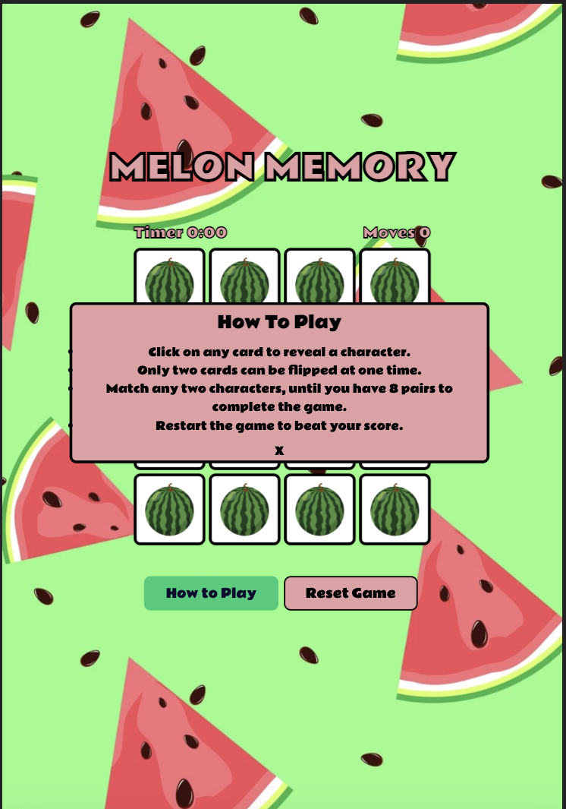
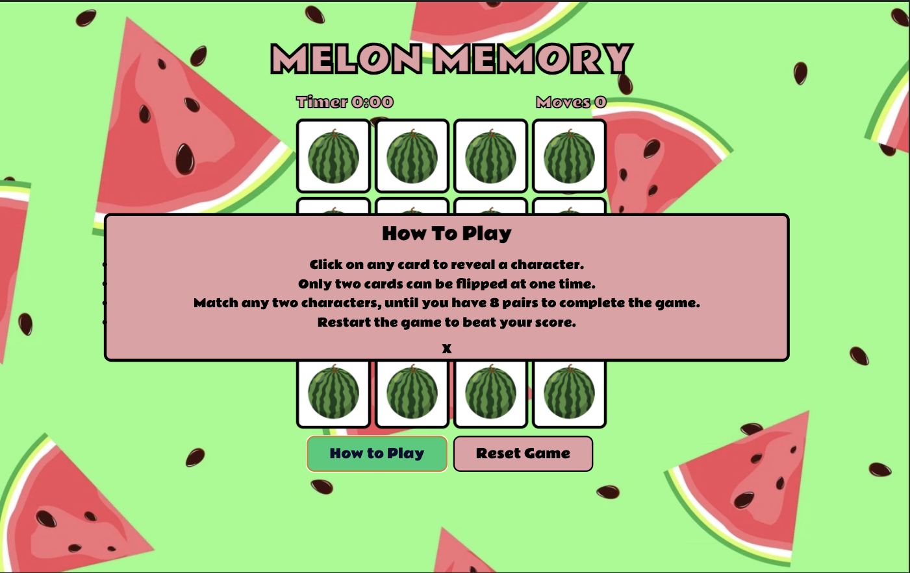

#  Melon Memory
 

# Introduction
This project is a classic memory game with a watermelon theme, where you click one card to reveal a character and you must choose another card to reveal the same character, if its not the same character you must restart and try to remember where those characters are to match the same two characters. When two characters are a match they will stay is position until all characters have been paired, with the final amount pairs being 8, revealing a time and the amount of moves it took to complete the game.

# Design
The goal of the game was to create and appealing and fun interactive game that the user can restart and play as many times as they wish. The game was designed with young users in mind targeting young children to adolescents, an emphasis on how fast and how many little moves you can do it in was used target the older age range, adding a competitive element to game. The timer counts up for as long is necessary so younger players don't have the added pressure of finishing the game under a set time. 

## Colors 
The color palette i chose for this project was obviously going to be based around watermelon colors, with an emphasis on contrast and brightness to intrigue a younger user to play the game. This was my initial color scheme.

## Fonts
The font chosen for the game was essential to the look and feel of the game, whilst searching i came across Rammetto One, i feel this font gave the game a very playful feel and would be attractive to a younger audience, with that in mind i made use of it throughout the game, to maintain the identity of the game. 

## User goals:
# Features
## Exisiting Features
## Future Features

## Fonts
# Manual Testing
# Lighthouse Testing
I used google chrome in incognito mode for lighthouse testing, i formatted all pictures to webp format to reduce loading time.

## Mobile Test.

## Desktop Test.
 

# Testing User Stories
# Validator Testing

## Css Validator

 

## Html validator
 

## Jshint validator
 

### All validation tests passed with no errors being found.

# Browser Compatibility
The website was tested on the following browsers:

|Browser  |Main Screenshot  |How To Play Screenshot    |Win Modal Screenshot   |Assessment   |   
|---      |---                                                           |---|---|---|
| Chrome  |  |  |   |  Some slight differential between modal positions |
| Microsoft Edge  |   |     |     |  Works as expected   |
| Firefox  |     |    |    |  Works as expected   | 
| Opera  |   | |    |  Works as expected   |
| Safari  |    |    |    | Works as expected  |

# Deployment
The website was deployed using github, these are the steps i followed.
* Login to github.
* click on settings tab placed above the green code button.
* On the left scroll to find "Pages" which will open up a new section.
* Go to source and select master branch.
* Once master branch has been selected, the page will give you a link indicating a successful deployment.
The link to the live website is here: 

If you wish to clone the repository these are the steps to take:
* Go to github repository.
* Go to the code button located next to the gitpod button and click.
* Select if you want to clone with https, SSH or Github CLI. 
* Click button beside url to copy to clipboard
* Open with github desktop, and follow the prompts to complete the clone. 
* Alternatively you can open Git Bash and change the current working directory, to where you want a cloned directory.
* Type git clone in the terminal, paste the URL you copied earlier, and press “enter” to create your local clone.

If you want to fork the repository you can click the fork button located towards the top right of the page.

# Responsive Design
|Device  | Screenshot  | Screenshot    | Screenshot   | Assessment  |   
|---      |---|---|---|---| 
|Galaxy fold  |   |    |  >  |   |   
|Ipad air  |  >   |    |    |   |   
| Nesthub max | >  |    |    |   
|Samsung galaxy s8 | >   |    |    |   |   
|Surface pro  |    |    |    |   |   
|Desktop dev/tools  |    |    |    |   |   

# Bugs

# Unfixed Bugs

 # Languages Used
 * HTML (Html was used for basic)
 * CSS  (CSS was used for for styling and web)
 * js (JavaScript was used for interactive content)

 # Websites & tools
 * [Wireframes](https://balsamiq.com/) (for wireframes and initial development ideas)
 * [Coolors](https://coolors.co/) (for color palette inspiration)
 * [Google Fonts](https://fonts.google.com/) (to choose the right fonts for my project)
 * [Google Maps](https://www.google.com/maps/) (to provide map for contact page)
 * [Fontawesome](https://fontawesome.com/)(for icons throughout project)
 * [GitHub](https://github.com/) (to store my repository)
 * [Gitpod](https://www.gitpod.io/) (to build my project and write code)
 * [Git](https://git-scm.com/) (for version control)
 * [freeconvert](https://www.freeconvert.com/)(to convert my png pictures to webp)
 * [W3C](https://validator.w3.org/) (Used to validate all my code)
 

## Credits

* [WC3](https://www.w3.org/) helped with star rating on testimonials and progress-bars on about page.
* [Stack Overflow](https://stackoverflow.com) Used throughout project to troubleshoot.
* [Youtube](https://youtube.com) Found lots of helpful videos to learn from and simplify code for me, during sticking points throughout the project.
* [Slack](https://slack.com) Used to reference and compare with other people's work. 

## Acknowledgements

I'd like to thank my mentor Mitko Bacharov for guiding me in the right direction, and pointing out all the bugs that i needed fixing. The online tutor team were also of great support in helping me de-bug some issues.

 

   

[def]: screenshots/color-palette.png